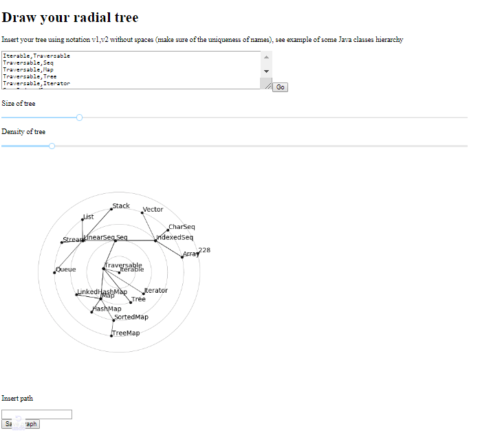
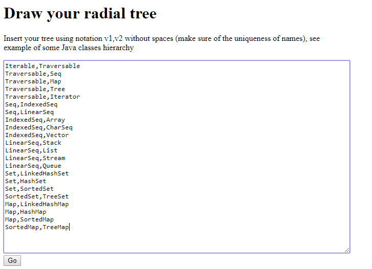
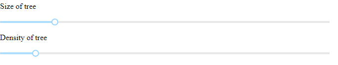
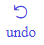
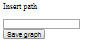

# RadialTree
Browser application for visualization of users tree

Available for changes: tree size, tree density; to save the tree, you must specify the full destination path 

##Instruction
1. Run pip install -r requirements.txt in console to install all dependencies
1. Start server.py in console
2. Open 127.0.0.1:8080 in browser

Appearance of application

Use input text area to insert your tree in the form of:
v1,v2
v1,v3
v1,v4
v2,v5
....
Push button Go to update the plot

Sliders allow to adjust size and density of the tree

Undo element revert changes

It's possible to save the tree using Save graph button 